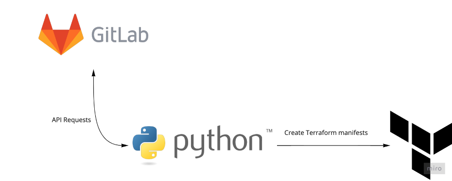

# terraformer_gitlab

Script for creating terraform(terragrunt) manifests with existing CD/CD variables in GitLab projects.

If your GitLab is not set up using terraform(terragrunt), you can generate configuration manifests for an already deployed GitLab server.

<center></center>

Requirements:
````commandline
python3.7 or hight

Python libs:
Jinja2==3.1.2
PyYAML==6.0
requests==2.27.1
urllib3==1.26.9
````

``scr/api_key/api-key.yaml`` - file with credentials for authorization in GitLab

example:
```
gitlab:
    api_key: <api key>
```

Running
```
python3 src/main.py
```

arguments:

````
--project_name      # Project name in GitLab
--new_project_id    # New project id in GitLab   
````

Output data:
````
<project_name>                  -- directory with project name
..\<project_name>-env.tf        -- File with gitlab_project_variable and locals
..\<project_name>-secrets.yaml  -- File with secret variables and value for sosp encrypt
..\terragrunt.hcl               -- Terragrunt file
..\variables.tf                 -- File with sercet variables 
````
